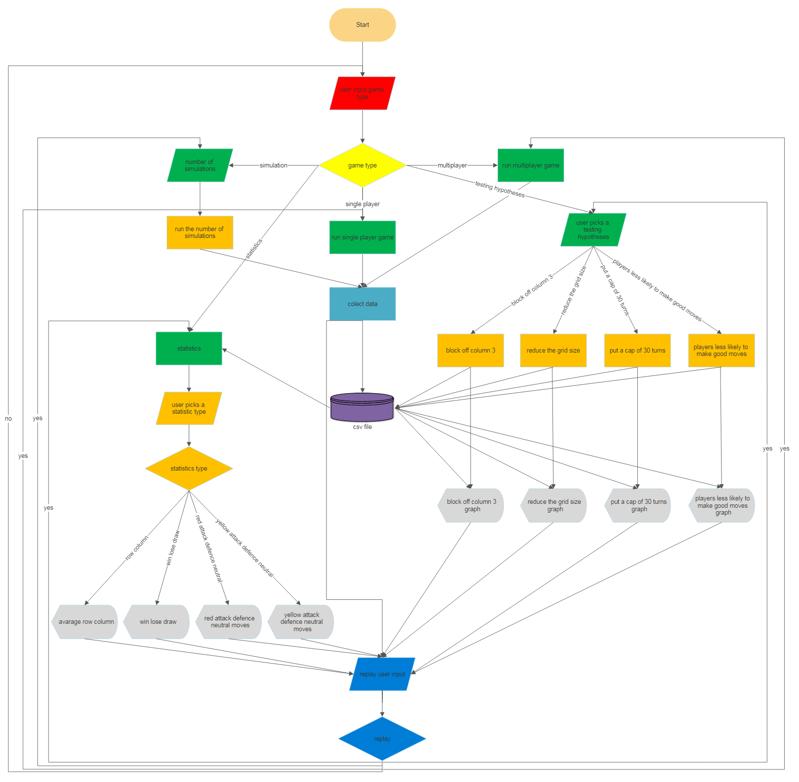

[Meeting the Brief](README.md) |
[Investigation and Plan](Investigation_&_plan.md) |
[Design](Design.md) |
[Implementation](Implementation.md) |
[Testing](Testing.md) |
[Evaluation](Evaluation.md) |
[References](References.md) |
[Summary word count](Word_count.md)

# Design
## Waterfall vs Agile Software Development
I will design the project using both Waterfall and Agile design process. I will mainly use the Waterfall method. I will make large sections to be added to the project in a specific pre-set order. These will be made one section at the time to be added. I will use this method for most of the project until nearer to the end when I will add finishing touches. These will be added using the Agile method as I found this gave me more freedom to make these small changes in an efficient and effective manner on the other projects I have done in the past. 

I will achieve my objectives in the following way: 

### Multiplayer mode  
The multiplayer mode will act like a normal connect 4 board, except it will tell the players when there is a win or draw. It will then collect this data in the [database](/database.csv)

### Single player  
The single player will have the computer finding good moves and playing these moves with some randomness, for example, it may not always play the move it sees as best. These moves will be played against a human player. It will then collect this data in the [database](/database.csv)

### Simulator mode 
The simulator will be the computer playing itself may times. It will use the same method of picking moves as was mentioned in the single player section. It will then collect this data in the [database](/database.csv)

### Statistics mode 
The statistics mode will obtain data put in the [database](/database.csv) from the multiplayer, single player and simulator modes and get the mean mode and median rows along with columns. It will also graph these. It will get the percentage of wins for each player and the percentage drawn and make a pie chart or it will get the percentage of neutral, offensive and defensive moves for each player and make a pie chart for each, depending on the user's choice. 

### Testing hypotheses and changing parameters 
Finally, I will add an option for testing hypotheses and changing parameters. You will be able to test 4 options: reducing the grid size, reducing and blocking off column 3, make a cap of 30 moves (Any move above this will cause a draw) and make the computer less likely to make good moves. This will run base games (normal games) and modified games and put them on a bar chart so you can see how the hypothesis chosen differs from the base games or so that you can use the data to make predictions. 

To help me achieve these objectives in a timely fashion I will use decomposition to break down these tasks into smaller easier to complete tasks. I will also consider Universal Design and try to make it simple and intuitive use and tolerance for error. 

## Modeling and Abstraction
During this project I modelled multiple real-world things. I modelled a connect 4 board/grid and the chips/counters that go in it. I modelled the gravity that would pull down the counters in a real connect 4 board and I modelled a human player that can be challenging to beat sometimes just like a real human player. 

I also used abstraction. I used this in multiple ways. I did not make a graphical user interface with perfect replicas of the chips and board, instead I used [PrettyTable](https://pypi.org/project/prettytable/) (an import) which use these symbols (| -  +) along with spaces to make the grid. I also used coloured ascii characters like this 🔴 🟡 to make the chips that went in the grid. As well as this I used numbers to take in the user's columns choice rather than a mouse pointer which was unnecessary. 

## FlowChart


# This is my Pseudocode for one of my functions:
```
function time_estimate(games_played)
    if games_played = 10
        end_time_ten = clock time
        ten_time = end_time_ten - start_time
        multiplayer = num_simulation/games_played
        estimate_time = multiplayer x ten_time
        round estimate_time
        print Estimated time = estimate_time s
```