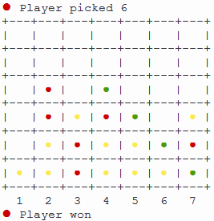
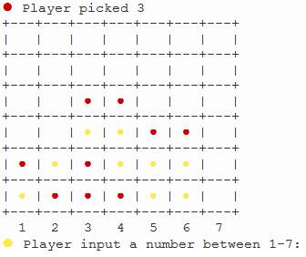
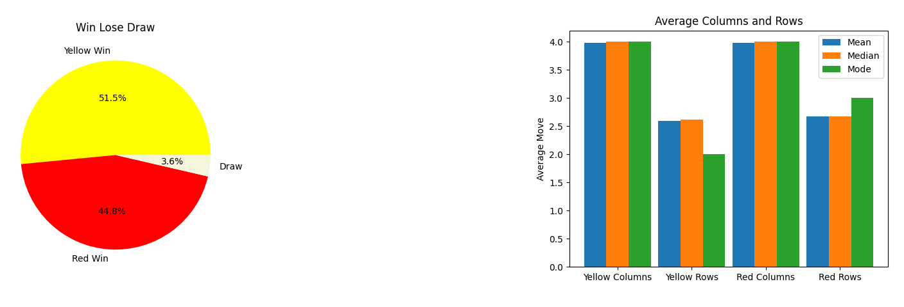

[Meeting the Brief](Meeting_the_brief.md) |
[Investigation and Plan](Investigation_&_plan.md) |
[Design](Design.md) |
[Implementation](Implementation.md) |
[Testing](Testing.md) |
[Evaluation](Evaluation.md) |
[References](References.md) |
[Summary word count](Word_count.md)

# Meeting the Brief
## Basic Requirement 1
The player will be able to play the game to completion by picking columns for chips, if they pick the single player or multiplayer modes. The computer in the single player mode will play differently each time with approximately 25% of computer moves in single player being completely random.



## Basic Requirement 2
The player will be able to choose a menu item (the first input) and will be asked for a number of simulations to run in the simulation mode. Then they will be asked their move in the single player, multiplayer modes and asked the graph type in the testing hypotheses and statistics modes (second input). Finally, the user will be asked if they what to replay the game the (third input). All the number inputs will be validated in a function I will call user_clean_data. This will check that they are integers between the values expected. Letter inputs (only used on the play_again function) will be validated by making the input lowercase and checking if it is “n” or “y” and this is then used to decide if a replay should take place.

`Input a number between 1-5: Replay? Input y or n:`

## Basic Requirement 3
The user will be able to interact and operate with the game in each of the modes mentioned. They will be able to play the game in single player and multiplayer mode, that being the interaction. They will be able to pick a number of simulations in simulation mode.

### Simulation

```
Input the number of simulations you require between 100-1000: 200
Estimated time = 3s
```

### Multiplayer ###


### Single player



## Advanced Requirement 1
Each time that the game is played it will store the wins, draws or losses, the mean columns and rows for both yellow and red, the percentage defensive offensive and neutral moves for both players, how may turns the game took to complete and finally the game mode. All this data will be put in the [database](/database.csv).

| win_lose | y_col | y_row | r_col | r_row | y_def  | y_n    | y_atk  | r_def  | r_n    | r_atk  | turn | g_type |
|----------|-------|-------|-------|-------|--------|--------|--------|--------|--------|--------|------|--------|
| Win      | 4     | 2.5   | 4.31  | 2.62  | 35.71% | 42.86% | 21.43% | 38.46% | 53.85% | 7.69%  | 27   | Sim    |
| Win      | 4.23  | 2.92  | 3.58  | 2.5   | 15.38% | 76.92% | 7.69%  | 25.00% | 75.00% | 0.00%  | 25   | Sim    |
| Lose     | 2.8   | 2.9   | 3.4   | 2.1   | 20.00% | 80.00% | 0.00%  | 20.00% | 60.00% | 20.00% | 20   | Sim    |
| Lose     | 2.91  | 3     | 4.45  | 2.27  | 45.45% | 54.55% | 0.00%  | 9.09%  | 54.55% | 36.36% | 22   | Sim    |
| Lose     | 3.67  | 3.25  | 2.92  | 2.83  | 25.00% | 75.00% | 0.00%  | 8.33%  | 83.33% | 8.33%  | 24   | Sim    |
| Win      | 3.8   | 2.87  | 4.07  | 2.86  | 20.00% | 66.67% | 13.33% | 50.00% | 50.00% | 0.00%  | 29   | Sim    |
| Lose     | 4.23  | 2.85  | 4.31  | 3     | 23.08% | 76.92% | 0.00%  | 30.77% | 61.54% | 7.69%  | 26   | Sim    |
| Lose     | 4.27  | 2.18  | 4     | 2.18  | 9.09%  | 81.82% | 9.09%  | 27.27% | 63.64% | 9.09%  | 22   | Sim    |
| Lose     | 3.94  | 3.12  | 4.29  | 3.18  | 41.18% | 58.82% | 0.00%  | 29.41% | 58.82% | 11.76% | 34   | Sim    |

## Advanced Requirement 2
If the user picks the statistics mode, they will be given 4 options:
```
1 = Red and yellow average columns and rows
2 = Red and yellow wins and draws
3 = Yellow attack, defense and neutral moves
4 = Red attack, defense and neutral moves
```
Picking any of these options will give the user a bar chart or a pie chart of the data from the [database](/database.csv). Depending on the option they pick, the first option red and yellow average columns and rows will have mean, median and mode and the other 3 options will have the mean of the data mentioned.

### An example pie chart and bar chart:



## Advanced Requirement 3
Finally, if the user picks the testing hypotheses and changing parameters option, they will be given 4 options:
```
1 = What if column 3 (one to the left of the middle column) is blocked off?
2 = What if the grid size is reduced from 7x6 to 6x6?
3 = What if there is a cap of 30 turns, above this is a draw?
4 = What if the players are less likely to make good moves?
```
They can then test these hypotheses or use the changed parameters to make future predictions for example I would predict that the cap of 30 turns would increase draws by serval percentage points.